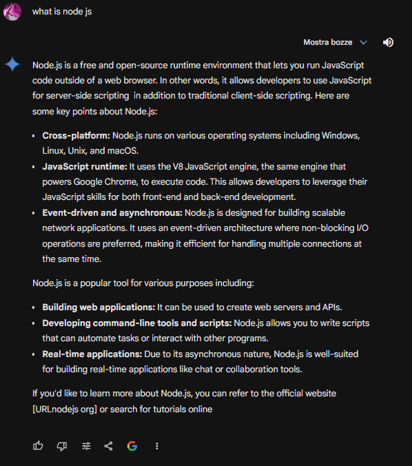
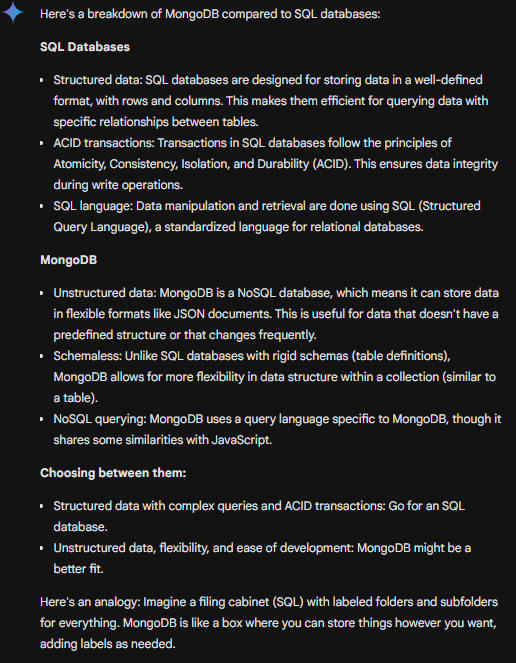
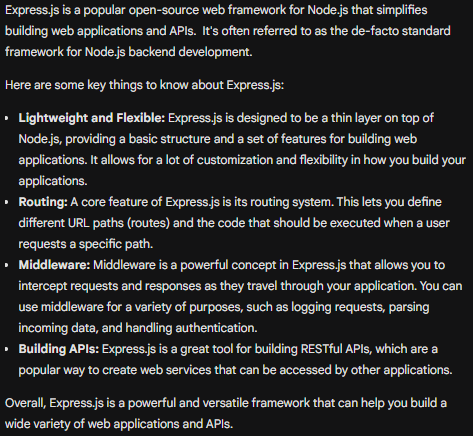

# Back-end

### The arguments are:

- [Info](info)
- [Node](node)
- [MongoDB](mongodb)
- [Express](express)


## Info

When you talk about back-end frist think as compost, this's compost: `serevr` and `database`. (these two not are forced to be together)
in past the server and client travelled together but now thanks middleware we can split them.

the functionality of this component are:

- client: interarct with user and return a request/response to server
- server: manages the request and return a response to client
- database: return a respos to server when this is called


## Node

#### The arguments are:
- [Introduction Node.js](#Introduction-Node.js)

### Introduction Node.js
If ask you "what is node js"? The reason is more seample, Node is equal to JS (JavaScript) whit some different features.
But if you are looking manual defintion:



When a developer start with Node say this's limited, if he's coming of web JS, but this is not correct. If you used JS and interacted with browser, you're using different commando as "Windows" (in web JS) in Node not are present, but you can use other command for do other as "readFileSync/writeFileSync".

When we talk about backend, we can usage more language as python, java or Node.js, lucky for us, we usage Node.js that are more sample.
in node are present different concept fundamental for a backend as: “Middleware”, “pagination”, “creation of APIs”, “validation content”, “data management” and others.

We now start with “Middleware”, what's this element? First we can talk about work flow, the basic flow is compost the request ('GET','POST','PUT','PATCH' & 'DELETE') , process the request with work that we want and finally back the results.
But only this work is more seample and not secure for our web app , we can improve 3 element for enhance our code:

- Middleware
- Validation content
- Data management


#### Middleware
If in the past we talk about work flow now this change in alternative model:

    - Old:
        ```
        1. request
            2. work request
                3. response
        ```

    - New:
        ```
        1. request
            2. middleware
                3. work request
                    4. response
        ```


Now that you know where it is allocated the middleware, it is essential that you know how to use it.
The middleware intercept the request and code inside at it and return the response, that can be an error or a response.
an example of middleware: 
1. Logging Middleware
2. Authentication Middleware
3. Authorization Middleware
4. Rate Limiting Middleware
5. Error Handling Middleware
6. Body Parsing Middleware
7. Cookie Parsing Middleware
8. Static File Serving Middleware

example of middleware:

```
    name.get('path/that/you/want', middleware, async (req, res, next)=>{
        try{
            constwork that you want
            res.json/send({result: data})
        }catch(err){
            next(err)
        }
    })
```

tip:
- "name" is name of route that we will use if using more than one route. but you can usage all route in a single file as "app.js"
- i set "get" but is onl example you can set "post", "put", "patch" and "delete"
- "path/that/you/want" is endpoi that you want

you can usage more than one same time, the syntax is: [name1, name2, name3]
example:

```
    name.get('path/that/you/want', [name1, name2, name3], async (req, res, next)=>{
        try{
            constwork that you want
            res.json/send({result: data})
        }catch(err){
            next(err)
        }
    })
```

Maybe some question that you have are:
How to set a middleware? How to import a middleware? Is essential to construct a middleware in different file?

strat to say that not essential that you creat a file only for middleware or a folder for middlewares but is a best practice for optimise the code.
but now look as you can creat a middleware:

```
    const error = (err, req, res, next) => {
        res.send({message: err , status: req.bod.status})
        next()
    }
    module.exports = error;
```
for import:

`const error = require('./middleware/error')` <- in file wher you want use middleware

are present two types of middleware:
- global middleware
- local middleware

that can different actions but you can split into two types:
- error
- request

1. error 
    is seample that know beacuse is only middleware that present "err" in parameter.
2. request
    is seample that know beacuse not have "err" in parameter, but can do other action.

you can set a global middleware and ona local middleware.
you can set "next(err)" in catch and the code skip the every part of it because stay search middleware eror. (because when you pass an error, only middleware error to be trigger)
a global for example can be the previous middleware ereor because you pass a error status and the message.
the local middleware is locate only for the single endpoint that you want.


i believe that's seample understand, if it were not so you can send me a message on <a href='https://www.linkedin.com/in/marco-de-vincentiis-98299a217'>Linkedin</a>

Now that you know what is a middleware, you can learn more about it as "multer".
are presente different types of multer:
- <a href='https://www.npmjs.com/package/multer'>multer</a>
- <a href='https://www.npmjs.com/package/multer-storage-cloudinary'>multer-storage-cloudinary</a>

#### Multer
What is multer?
Multer is a middleware that allows you thake and managing files that user pass in request.
you can storage in local (in server) or in a cloud (example cloudinary). 
for the multer local storagare, you can do:
1. install: "npm install --save multer".
2. create a form where you can insert the value. (pls remember when you crea the form to insert value name bacause you will use it)
3. create function to storage on disk:
    ```
    const storage = multer.diskStorage({
        destination: function (req, file, cb) {
            cb(null, '/tmp/my-uploads')
        },
        filename: function (req, file, cb) {
        const uniqueSuffix = Date.now() + '-' + Math.round(Math.random() * 1E9)
        cb(null, file.fieldname + '-' + uniqueSuffix)
        }
    })

    const upload = multer({ storage: storage })
    ```
4. creat routse for upload photo, example:
    ```
    const express = require('express')
    const multer  = require('multer')
    const upload = multer({ dest: 'uploads/' })

    const app = express()

    app.post('/profile', upload.single('avatar'), function (req, res, next) {
    // req.file is the `avatar` file
    // req.body will hold the text fields, if there were any
    })
    ```
    in this example i set that user can pass only one file, but you can set multiple file.

    example :
    - upload.array('photos', 12)
    or
    - upload.fields([{ name: 'avatar', maxCount: 1 }, { name: 'gallery', maxCount: 8 }])
    but rememebre of pass the value with name that you have set in form.

#### Multer Storage Cloudinary 
for using multer cloudinary you can do:
1. install: "npm install multer-storage-cloudinary".
2. creat middleware:
    ```
        const cloudinary = require('cloudinary').v2;
        const { CloudinaryStorage } = require('multer-storage-cloudinary');
        const express = require('express');
        const multer = require('multer');
        
        const storage = new CloudinaryStorage({
        cloudinary: cloudinary,
        params: {
            folder: 'some-folder-name', //set a folder that you want using in cloudinary (that is present or will using)
            format: async (req, file) => 'png', // type file that you want using in cloudinary
            public_id: (req, file) => {file}, // set a public id that you want using in cloudinary (if you rest only file as name you can get all info from upload)
        },
        });
        
        const parser = multer({ storage: storage }); //set storage parameters that will usage in multer 
        module.exports = parser
    ```
3. set middleware in route that you want usage:
    ```
        import parser = from (../path/that/you/want)

        routeCloudinary.post('/upload', parser.single('image'), function (req, res) {
            res.json(req.file);
        })
    ```
if you want more info this is officialy link:
- <a href='https://www.npmjs.com/package/multer-storage-cloudinary'>multer-storage-cloudinary</a>
- <a href='https://cloudinary.com/'>cloudinary</a>

#### Bcrypt
When we get password or sensitive data in our DB generally we crypt the data.
how can we do it? it's easy with <a href='https://www.npmjs.com/package/bcrypt'>Bcrypt</a>, what's concept of Bcrypt?

1. client send data
2. server get data sent by client
3. server crypt data
4. server send data crypt to db

what is process:
```
1. install bcrypt: "npm install bcrypt"

2. require:
    const bcrypt = require('bcrypt'); // require bcrypt
    const saltRounds = 10; // how many times it is encrypted
    const myPlaintextPassword = 's0/\/\P4$$w0rD'; // password that you want using for cripting

3. cript:
    bcrypt.genSalt(saltRounds, function(err, salt) {
        bcrypt.hash(myPlaintextPassword, salt, function(err, hash) {
            // Store hash in your password DB.
        });
    }); 
```

if you want check the password is correct or not:
```
 compare:
    bcrypt.compare(myPlaintextPassword, hash, function(err, result) {
        // result == true
    });
```

tip for a good encryption:
- set a elevate number of saltRounds (if for you machine is possible do more action)
- set a complex password in myPlaintextPassword because is essetial for security.

## MongoDB

#### The arguments are:
- [Introduction MongoDB](#Introduction-MongoDB)

### Introduction MongoDB
MongoDB is a NoSQL Data-Base this's different traditional form, what? why?



when you want interact with MongoDB you can do 2 type action:
1. using the terminal present on MongoDB altlast
2. using a back-end language for helping you interact with MongoDB.

example when you interact with this:
- create a "Schema" that function for structure our DB for struction of him.
    ```
    const mongoose = require('mongoose'); //require mongoose for interarct with db
    cinst SchemaThatYouWant = new mongoose.Schema({
        name:{
            type:String,//type of element that we want to store
            required:true//set that this element is required
        },
        surname:{
            type:String,
            required:true
        },
        age:{
            type:Number,
            required:true
        },
        email:{
            type:String,
            required:true,
            unique:true//set that this element is unique in this collection
        }
    })

    module.exports = mongoose.model('NameThatYouWant', SchemaThatYouWant) //export schema struction
    ```
    p.s.
    MongoDB work with collection that are similar table but are different for structure.

- recall the schema in file for route (is a good practices), example you have "user" you inser this file in "./routes/user/user.js", inside of you insert the schema.
    example when you recall route file:
    ```
    const Express = require('express');//recall express
    const nameThatYouWantForRacallAfterRoute = express.Router();//recall route
    const SchemaThatYouWant = require('../models/NameThatYouWant');//recall schema

    nameThatYouWantForRacallAfterRoute.post('/create', async (req, res) => {
        const newUser = new SchemaThatYouWant({
            name: req.body.name,
            surname: req.body.surname,
            age: req.body.age,
            email: req.body.email
        }) //define object to send to DB, this object respect the structure of schema
        try {
            const savedUser = await newUser.save();
            res.json(savedUser);
        } catch (err) {
            res.json({ message: err });
        }
    })

    ```

- last you recall the file router (that you want) in app that is file that you start for lauch server.
```
    const express = require('express');//recall express
    const cors = require('cors');//recall cors
    const app = express()//recall express to asigning to app
    const PORT = portThatYouWant//start port for run servicess on server
    require('dotenv').config();//recall dotenv for use .env file for don't show password in terminal
    const {default: mongoose} = require('mongoose');//recall mongoose
    const app.use(cors())//recall cors

    const nameThatYouWantForRacallAfterRoute = './path/to/route/file' //recall route file
    mongoose.connect(process.env.DB_CONNECT) //connect to DB
    const db = mongoose.connection //start connection to DB
    db.on('error', (error) => console.log(error)) //check for error in connection to DB
    db.once('open', () => console.log('Connected to DB')) //check for connection to DB

    app.use(express.json()) //using for tell db that talk with Json
    app.use('/', nameThatYouWantForRacallAfterRoute) //recall route

    app.listen(PORT, () => console.log(`Server is running on port ${PORT}`)) // for check server is running

```


## Express

#### The arguments are:
- [Introduction Express](#Introduction-Express)

### Introduction Express
What is Express?
Express is framework that help costruct web app in Node.js, is more easy to learn.
If you are looking manual defintion:


  

