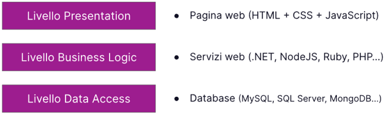
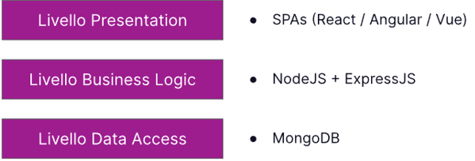
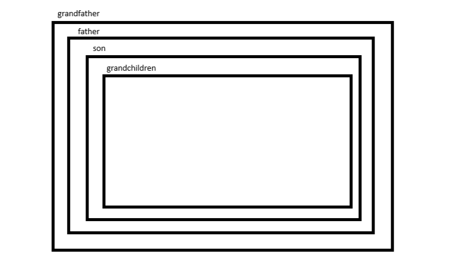
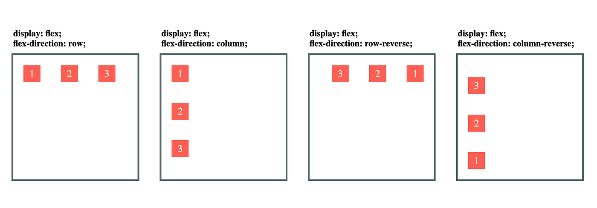
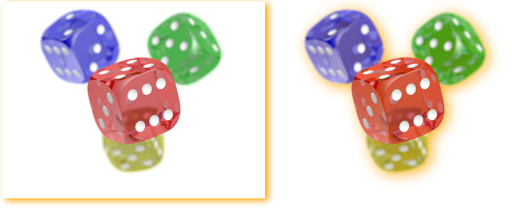
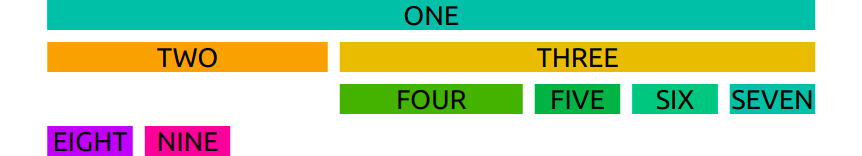

# Module 1

## Introduction web developer (front-end & back-end)

when speak a developer us can split in two figure:
1. front-end developer
    - the front-end developer using mainly the:"HTML, CSS, Javascript/other language,  Library and freamework as bootstrap and tailwind".
2. back-end developer
    - the back-end developer using similar but same time different for logic and other aspect: "NodeJS, Pytohn, Java end other language/freamework"

developers use the same working method:
<br>


when say full-stack it is understood 3 layers:



now the tools more usage / trendy are:




## HTML

HTML is: Hyper Text Markup Language 

With HTML creat "DOM" (Document Object Model) thet we interact with JS (JavaScript) and CSS (Cascading Style Sheets)

In HTML are present different tag for different "situation"

example:

```
- Title: <h1>,<h2>,<h3>,<h4>,<h5>

- Paragaraph: <p>

- Image: 

- Container Image: <figure>

- Button: <button>

- Special section in a text: <span>

```

but when speak of struction of body u can follow this struction:

```
<body>

        <header>
            <!-- place navbar here -->
        </header>
        <nav>
            <!-- place nav here -->
        </nav>
        <main>
            <!-- place main here -->
        </main>
        <footer>
            <!-- place footer here -->
        </footer>

</body>
```

we cand say taht HTML is struction of page


## CSS

CSS is: Cascading Style Sheets

when speak of CSS say style of page.

the sintation is different than other languages example:

```
examples by name element:
    body {
        margin: 0;
        padding: 0;
    }

example by class element:
    .divByExample {
        margin: 10px;
        padding: 10px;
        fontsize: 10px;
        background-color: red;
    }

example by ID element:
    #divByExample {
        margin: 10px;
        padding: 10px;
        fontsize: 10px;
        background-color: red;
    }

```

same syntax for other tag (element / class / id).

an important thing in CSS is FLex-box, this's more important for set position of element and regularize struction of page.

frist say commands of Flexbox we can say structor of system, we can say are present a grandfather, father, son and grandchildren.

example:



we can call a parents with a similar syntax  said before, remember that you can call a parent with a different syntax for thifferent situation.

```
example from grandfather to grandchildren:

main > div > p{
    color: red;
}

main is "grandfather" , div "father" and p is "grandchildren" (or "son" of "father")

```

Principal regular flexbox: "when the father says a command, the son accepted”
But remember that the son can set new command inside for command his sons.

the propiety / commad in FlexBox are different following commands are some:

```
example father with son:

.father{
    display: flexbox;
    flex: wrap;
}

.son1 {
    width:200px;
}

.son2 {
    width:200px;
}


in this case when the screen width is smaller than sum son1 and son2 , the children pass one underneath to the other.


example:

screen width > sum :

"
son1 son2
"

screen width < sum :

"
son1
son2
"

```

if you want amplyed your command you can follow this website: <a href='https://css-tricks.com/snippets/css/complete-guide-grid/'> css-tricks </a>

now that you have learned how to use the css and principal commands, you can just follow these commands for learn flex-box

```

father {
    display: flex
    justify-content: center
    align-items: center
}

son{
    bgcolor: white
    width: 200px
    height: 200px
}

```
 
 in this case you have set the elemnt in center of display.
 the element / command that you must learn is "display: flex"  this enables to flex-box, with flex-box you can set position of a elemnet in different methods.
 now us see seample method with "justify-content e align-items", remembre this command is differente by orientation of elemnet.
 this follow image is example how you can set orientation of elemnet in different methods. (the command is  " flex-direction: direction ")

 

 you can set other types of position with :

 - Relative 
 - Absolute
 - Sticky
 - Fixed
 - Static

an example of this command is prensent in <a hreft='https://css-tricks.com/absolute-positioning-inside-relative-positioning/'> css-tricks </a>

list and example of command of css style:

    - when we want shadow of an object we can set propiety "box-shadow" but in some case we want the shadow of a elemnti in png we can usage "filter: drop-shadow()"

        example:

        ```
        CSS:

        .img1{
            box-shadow: 10px 7px 20px orange;
        }

        .img2{
            filter: drop-shadow(10px 7px 20px orange);
        }


        HTML:
        
        <!DOCTYPE html>
        <html lang="en">
        <head>
            <meta charset="UTF-8">
            <meta name="viewport" content="width=device-width, initial-scale=1.0">
            <title>Document</title>
            <link rel="stylesheet" href="./assets/css/style.css">
        </head>
        <body>
            
            
        </body>
        </html>

        ```

        the result is:

        

    - If you want apply a background color to the text, you can use the following syntax:

        ```
        text{
        background-color: black;
        }
        ```

        but if you want clip a img as backgrount color you can use the following syntax:

        ```
        HTML:

        <!DOCTYPE html>
        <html lang="en">
        <head>
            <meta charset="UTF-8">
            <meta name="viewport" content="width=device-width, initial-scale=1.0">
            <title>Document</title>
            <link rel="stylesheet" href="./assets/css/style.css">
        </head>
        <body>
            <h1>MY TEXT HAVE A BG</h1>
        </body>
        </html>

        CSS:

        h1{
        background-image: url("https://files.123freevectors.com/wp-content/original/105927-blue-and-white-diagonal-lines.jpg");
        background-size: cover;
        background-clip: text;
        -webkit-background-clip: text;
        color: transparent;
        font-family: Arial, Helvetica, sans-serif;
        }
        ```


### Animations

#### hover

if you want activate an element whend you hover on a element you can usage the following command:

```
.card{
    background-color: aquamarine;
}

.card:hover{
    background-color: red;
}
```

in this case you are changing the backgroundwhend you do hover on element, but you can usage this action for other effect.

andvanced element:

```
HTML:

    <div class="cards">
        <div class="card red">
            <p class="tip">Hover</p>
            <p class="second-text">LOREM</p>
        </div>
        <div class="card blue">
            <p class="tip">Hover</p>
            <p class="second-text">LOREM</p>
        </div>
        <div class="card green">
            <p class="tip">Hover</p>
            <p class="second-text">LOREM</p>
        </div>
    </div>

CSS:

.cards{
    display: flex;
    flex-direction: row;
    gap: 15px;
    font-family: Arial, Helvetica, sans-serif;
}

.red{
    background-color: red;
}

.blue{
    background-color: blue;
}

.green{
    background-color: green;
}

.cards .card{
    display: flex;
    align-items: center;
    justify-content: center;
    flex-direction: column;
    text-align: center;
    height: 100px;
    width: 100px;
    border-radius: 10px;
    color: white;
    cursor: pointer;
    transition: 400ms;
}


.cards .card p.tip{
    font-size: 1em;
    font-weight: 700;
}

.cards .card p.second-text{
    font-size: 0.7em;
}

.cards .card:hover{
    transform: scale(1.2,1.2);
}

.cards:hover > .card:not(:hover){
    filter: blur(10px);
    transform: scale(0.9,0.9);
}


```

#### keyframes

Now that you know hover effect, and general effects, i can say "animations" in CSS.

You developing a code and apply a simple code as:

```
.card{
    background-color: aquamarine;
}

.card:hover{
    background-color: red;
}
```

The color change in few seconds, for people this is strange because better see a gradual change that istant change.

for this you effect can create a animation, example:

```
.card{
    background-color: aquamarine;
}

.card:hover{
    animation: change-color 1s linear forwards !important;
}

@keyframes change-color{
    from{
        background-color: aquamarine;
    }to{
        background-color: red;
    }
}
```

what is "keyframes" ? keyframes is rule in CSS for strat a animation, the syntax is similar:


```
@keyframes x{
    from{
        background-color: aquamarine;
    }to{
        background-color: red;
    }
}

@keyframes y{
    0%{
        background-color: aquamarine;
    }50%{
        background-color: blue;
    }100%{
        background-color: red;
    }
}
```

the main different between these syntax is:

1. start in a position and finish other 
2. start in a position, pass in other and ends in another

(the explanation is more sample because this's essentially for function of this feature)


> [!TIP]<br>
> Remember that few the people developing in only CSS and HTML, maybe you will usage a library or framework as: "bootstrap or tailwind".


## Bootstrap and Tailwind

Bottstrap and Tailwind are available in the following links:

- <a href='https://getbootstrap.com/docs/5.3/getting-started/introduction/'> Bootstrap </a>

- <a href='https://tailwindcss.com/docs/installation'> Tailwind </a>

these are the most popular framework, tailwind is different by bootstrap because tailwind talk to machine in low level languge.
the syntax is different by between their an expression is color.
In bootstrap are presnet default colors same tailwind but in tailwind is possible to customize an example: 

```

bootstrap:
<p class="text-primary">.text-primary</p>
<p class="text-secondary">.text-secondary</p>
<p class="text-success">.text-success</p>
<p class="text-danger">.text-danger</p>
<p class="text-warning">.text-warning</p>
<p class="text-info">.text-info</p>
<p class="text-light bg-dark">.text-light</p>
<p class="text-dark">.text-dark</p>
<p class="text-muted">.text-muted</p>
<p class="text-white bg-dark">.text-white</p>


tailwind:

<p class="text-sky-400/100">The quick brown fox...</p>
<p class="text-sky-400/75">The quick brown fox...</p>
<p class="text-sky-400/50">The quick brown fox...</p>
<p class="text-sky-400/25">The quick brown fox...</p>
<p class="text-sky-400/0">The quick brown fox...</p>

special:
<p class="text-[#50d71e]">The quick brown fox...</p>

```


in taiwild the special syntax "text-[...]" allows us are specifically in value that as want

but maybe a most specifically feature usage is sistem grid, that is dofferent in between their.

### Bootstrap
- in bootstrap follow this path for build a good sistem grid: 

```
.container
    .row
        .col
```

- are present differente types container you can finde in this <a href='https://getbootstrap.com/docs/4.0/layout/grid/'>link</a> 

- remember taht you can insert more col in row but you can't insert more rows in the row.

```
    YES:
    .container
        .row
            .col-6
            .col-6
            
    NO:
    .container
        .row
            .row
            .row
```

but you can insert more rows in a col
```
.container
    .row
        .col
            .row
            .row
```
you can replace the cycle

most important that you follow the great path 

```
.container
    .row
        .col
```

- remember that you can max set of number of col 12.

### Tailwind

in tailwind, you can use the following path for construction the system grid:

```
<div class="min-h-screen flex items-center justify-center">
  <div class="grid grid-cols-3 grid-rows-3 gap-4">
    <div>Cell 1</div>
    <div>Cell 2</div>
    <div>Cell 3</div>
    <div>Cell 4</div>
    <div>Cell 5</div>
    <div>Cell 6</div>
    <div>Cell 7</div>
    <div>Cell 8</div>
    <div>Cell 9</div>
  </div>
</div>
```

an example of system grid is:



is more similar to bootstrap because max number of columns are 12 (as bootstrap)
but the substantial difference is that:

- bootstrap usage call as "conatiner, row and col"
- tailwind usage only call "grid grid-cols grid-rows"

Us started say the main differences because are essential for start to say more argument in simple mode, having said that if you have a quetsion / problem you can write me for requesting help.

