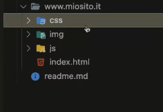

# Module 1

## Introduction web developer (front-end & back-end)

when speak a developer us can split in two figure:
1. front-end developer
    - the front-end developer using mainly the:"HTML, CSS, Javascript/other language,  Library and freamework as bootstrap and tailwind".
2. back-end developer
    - the back-end developer using similar but same time different for logic and other aspect: "NodeJS, Pytohn, Java end other language/freamework"

developers use the same working method:
<br>



## HTML

HTML is: Hyper Text Markup Language 

In HTML are present different tag for different "situation"

example:

```
- Title: <h1>,<h2>,<h3>,<h4>,<h5>

- Paragaraph: <p>

- Image: 

- Container Image: <figure>

- Button: <button>

- Special section in a text: <span>

```

but when speak of struction of body u can follow this struction:

```
<body>

        <header>
            <!-- place navbar here -->
        </header>
        <nav>
            <!-- place nav here -->
        </nav>
        <main>
            <!-- place main here -->
        </main>
        <footer>
            <!-- place footer here -->
        </footer>

</body>
```


## CSS

CSS is: Cascading Style Sheets