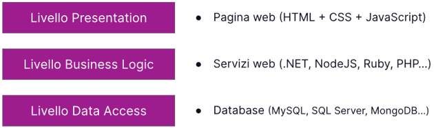

# Module 1

## Introduction web developer (front-end & back-end)

when speak a developer us can split in two figure:
1. front-end developer
    - the front-end developer using mainly the:"HTML, CSS, Javascript/other language,  Library and freamework as bootstrap and tailwind".
2. back-end developer
    - the back-end developer using similar but same time different for logic and other aspect: "NodeJS, Pytohn, Java end other language/freamework"

developers use the same working method:
<br>


when say full-stack it is understood 3 layers:



now the tools more usage / trendy are:


## HTML

HTML is: Hyper Text Markup Language 

With HTML creat "DOM" thet we interact with JS (JavaScript) and CSS (Cascading Style Sheets)

In HTML are present different tag for different "situation"

example:

```
- Title: <h1>,<h2>,<h3>,<h4>,<h5>

- Paragaraph: <p>

- Image: 

- Container Image: <figure>

- Button: <button>

- Special section in a text: <span>

```

but when speak of struction of body u can follow this struction:

```
<body>

        <header>
            <!-- place navbar here -->
        </header>
        <nav>
            <!-- place nav here -->
        </nav>
        <main>
            <!-- place main here -->
        </main>
        <footer>
            <!-- place footer here -->
        </footer>

</body>
```

we cand say taht HTML is struction of page


## CSS

CSS is: Cascading Style Sheets

when speak of CSS say style of page.

the sintation is different than other languages example:

```
examples by name element:
    body {
        margin: 0;
        padding: 0;
    }

example by class element:
    .divByExample {
        margin: 10px;
        padding: 10px;
        fontsize: 10px;
        background-color: red;
    }
```

same syntax for other tag (element / class / id).

an important thing in CSS is FLex-box, this's more important for set position of element and regularize struction of page.

frist say commands of Flexbox we can say structor of system, we can say are present a grandfather, father, son and grandchildren.

example:


we can call a parents with a similar syntax  said before, remember that you can call a parent with a different syntax for thifferent situation.

```
example from grandfather to grandchildren:

main > div > p{
    color: red;
}

main is "grandfather" , div "father" and p is "grandchildren" (or "son" of "father")

```

Principal regular flexbox: "when the father says a command, the son accepted”
But remember that the son can set new command inside for command his sons.

the propiety / commad in FlexBox are different following commands are some:

```
example father with son:

.father{
    display: flexbox;
    flex: wrap;
}

.son1 {
    width:200px;
}

.son2 {
    width:200px;
}


in this case when the screen width is smaller than sum son1 and son2 , the children pass one underneath to the other.


example:

screen width > sum :

"
son1 son2
"

screen width < sum :

"
son1
son2
"

```

if you want amplyed your command you can follow this website: <a href='https://css-tricks.com/snippets/css/complete-guide-grid/'> css-tricks </a>


 