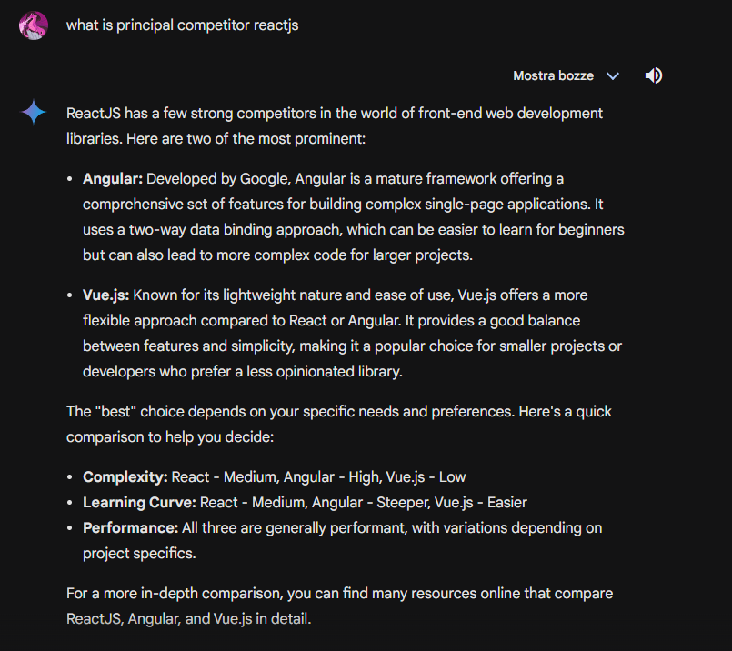
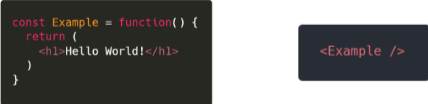
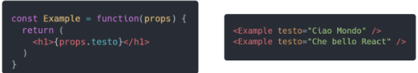
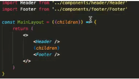
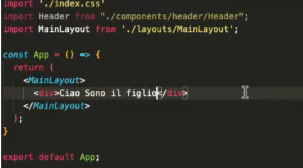
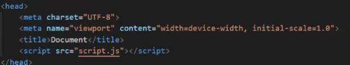

# REACT

### in this caption we look:
1. the basic teory react
2. how start a basic project with react
3. how to funcion basic in react
4. how to impruve a library (as bootstrap) or framework (as tailwind)


## List of arguments

- [Basic teory React](#basic-teory-react)

- [ReactBootstrap and seample Bootstrap](#reactbootstrap-and-seample-bootstrap )

## Basic teory React 

When we say "what is react?" this's a library that allows us using component for building a our project in smart mode.
(remember that react is library end not is framework as Angular)
React is a most popular library that in the word for developing front-end, his competitor are: "Angular, Vue.js".
this info is available on gemini IA, are valid until today 11/04/2024:



i want say that all actions we can do it with react can be done 'normal' js.
react is build by Meta and using in facebook, in 2013 is released how project Open Source.
with react we not manipulated "DOM" but Interacting with "virtual DOM".
are present different methods for "install" react, using CDN or using NodeJs for install a boilerplate of react.
now i say how to using NodeJS for install boilerplate of react.


1. create a folder

2. opend the CMD in the folder (open the folder right click selct "open CMD")

3. past this command in CMD

```
- npm install -g create-react-app

- npx create-react-app appName

- cd .\appName\ 

- npm start   
```

> [!NOTE]  
> This's not only method for download react, are present different methods for install react an example is with <a href='https://vitejs.dev/guide/'>Vite</a>

now that you have creat your place for work i can say that React using the "jsx" as syntax, this is more similar to simple js but is a version with steroids, then we will see the differences.

in react are present a particular consept, you can imagine your app as body and this is component by atoms, we can say that atoms are component develop in React.
we can replay the same atom in more part of body.
(we can "simply say" that the components are classical functions/callback.)

example of component:



Another essential propiety essentially is the "proprs" , we can set more value in a function/component/atom with the props, an example:



you can import primitive values (string,numeric,array and object) and callBack.

> [!TIP]<br>
> when you callback a props you can "destructure" the propieties using thi syntax:
> ```
>const Example = function({example1, example2, ...example3}) {
>   return(
>   <h1>example1</h1>
>   <p>example2</p>
>   <p>example3</p>
>   )}
> ```
Is present a special props this's call "children" an example of this props is:



his function is insert props value that we passed in side the component/atom.



the results is:


remember when you want start create an element you must insert all element in a div or in a  react fragment, example:

```
const Example = function() {
   return(
   <div>
    <h1>example1</h1>
    <p>example2</p>
    <p>example3</p>
   </div>
)}

OR

long form:

const Example = function() {
   return(
   <React.Fragment>
    <h1>example1</h1>
    <p>example2</p>
    <p>example3</p>
   </React.Fragment>
)}


contract form:

const Example = function() {
   return(
   <>
    <h1>example1</h1>
    <p>example2</p>
    <p>example3</p>
   </>
)}
```

> [!TIP]<br>
>
>#### Remember that only a tip, this function if not essential for your code don't apply.
>
>if you want get data by server frist that load page you can inser the "request" in head as your application can be loaded with the data inside.  
>example:
>
>
>
>p.s.
>remember that this has necesry need onload function 


A few moment ago we said that React using JSX and not only JS, what is the different?
JSX means "JavaScript XML", when in past us using only: "HTML, CSS and JS" for creating a good web app now is using "JSX" for modify the "Virtual DOM / React DOM" then do merge with real DOM.

example of old basic code/olde code:
```
HTML:
   <html>

   <head>
      <title>To-Do List App</title>
      <link rel="stylesheet" type="text/css" href="style.css">
   </head>

   <body>
      <div class="container">
         <h1>To-Do List</h1>
         <input type="text" id="taskInput" placeholder="Add a new task..." />
         <button onclick="addTask()">Add Task</button>
         <ul id="taskList"></ul>
      </div>

      <script src="script.js"></script>
   </body>

   </html>


CSS:

   body {
      font-family: Arial, sans-serif;
      margin: 0;
      padding: 0;
      background-color: #f2f2f2;
   }

   .container {
      width: 80%;
      margin: 0 auto;
      padding: 20px;
      background-color: white;
      box-shadow: 0 2px 4px rgba(0, 0, 0, 0.1);
   }

   h1 {
      text-align: center;
      color: #333;
   }

   input,
   button {
      padding: 10px;
      margin: 10px 0;
      width: 100%;
      box-sizing: border-box;
   }

   ul {
      list-style: none;
      padding: 0;
   }

   li {
      padding: 10px;
      margin: 5px 0;
      background-color: #e2e2e2;
      display: flex;
      justify-content: space-between;
      align-items: center;
   }

   .completed {
      text-decoration: line-through;
      color: gray;
   }


JS:

   function addTask() {
      const taskInput = document.getElementById('taskInput');
      const taskList = document.getElementById('taskList');

      const taskText = taskInput.value.trim();

      if (taskText !== "") {
         const newTask = document.createElement('li');
         newTask.textContent = taskText;

         const removeButton = document.createElement('button');
         removeButton.textContent = 'Remove';
         removeButton.onclick = () => removeTask(newTask);
         newTask.appendChild(removeButton);

         newTask.addEventListener('click', () => toggleComplete(newTask));

         taskList.appendChild(newTask);

         taskInput.value = "";
      }
   }

   function removeTask(task) {
      task.remove();
   }

   function toggleComplete(task) {
      task.classList.toggle('completed');
   }

```

In react sintax:

```
import React, { useState } from 'react';
import './App.css';

function App() {
    const [tasks, setTasks] = useState([]); 
    const [taskInput, setTaskInput] = useState(''); 

    const addTask = () => {
        if (taskInput.trim()) {
            setTasks([...tasks, { text: taskInput.trim(), completed: false }]);
            setTaskInput('');
        }
    };

    const removeTask = (index) => {
        const updatedTasks = tasks.filter((_, taskIndex) => taskIndex !== index);
        setTasks(updatedTasks);
    };

    const toggleComplete = (index) => {
        const updatedTasks = tasks.map((task, taskIndex) => {
            if (taskIndex === index) {
                return { ...task, completed: !task.completed };
            }
            return task;
        });
        setTasks(updatedTasks);
    };

    return (
        <div className="container">
            <h1>To-Do List</h1>
            <input
                type="text"
                value={taskInput}
                onChange={(e) => setTaskInput(e.target.value)}
                placeholder="Add a new task..."
            />
            <button onClick={addTask}>Add Task</button>
            <ul>
                {tasks.map((task, index) => (
                    <li
                        key={index}
                        className={task.completed ? 'completed' : ''}
                        onClick={() => toggleComplete(index)}
                    >
                        {task.text}
                        <button onClick={() => removeTask(index)}>Remove</button>
                    </li>
                ))}
            </ul>
        </div>
    );
}

export default App;
```
the css is same

In React are present different components that you can use, an example is: "hook".
the `"hook"` are functions that allow you to use state and other React features without writing a class. 

list of hook:
```
1. useState
   - Allows you to add state to functional components.
   - Returns an array with the current state value and a function to update it.

2. useEffect
   - Allows you to perform side effects in functional components.
   - It can be used for data fetching, subscriptions, setting up timers, and more.
   - Takes a callback function and an optional dependencies array.

3. useContext
   - Allows you to use context (provided by React.createContext) in functional components
   - Useful for managing global state across the app.
   
4. useReducer
   - An alternative to useState that allows more complex state management.
   -Provides a reducer function to handle state changes and a dispatch function.
   
5. useMemo
   - Allows you to memoize expensive functions so they don't run unnecessarily.
   - Returns a memoized value.
   
6. useCallback
   - Allows you to memoize functions to prevent unnecessary re-creations.
   - Returns a memoized function.
   
7. useRef
   - Allows you to create a mutable reference to a value that persists across re-renders.
   - Often used for accessing and manipulating DOM elements.
   
8. useLayoutEffect
   - Similar to useEffect, but runs synchronously after all DOM mutations.
   - Useful for layout-related changes that need to be made before the browser repaints the UI.
   
9. useImperativeHandle
   - Allows you to customize the instance value that is exposed to a parent component when using `forwardRef`.
   - Useful for creating custom component APIs.
   
10. useDebugValue
   - Allows you to add a label for custom hooks to aid in debugging.
   - Displays the label in React DevTools.
   
11. Custom Hooks
   - These are functions that let you extract and reuse component logic.
   - Custom hooks use the built-in hooks mentioned above to create reusable and modular functions.
   
```


## ReactBootstrap and seample Bootstrap 

Now that you know what is "JSX", what doing react with DOM now we can say introduce React-Bootstrap and seample Bootstrap.

> [!NOTE]  
> If you don't know what is "Bootstrap" please read the file of this argument

for the installing you can follow the following documentation: <a href='https://www.geeksforgeeks.org/react-bootstrap-dropdown-component/'>React Bootstrap Download</a>

Why us using react-bootstrap? Because some elements in bootstrap interact with real DOM and this is a problem because when using React you stay to work on virtual DOM then do merge with real DOM.
In React Bootstrap are present few components, but remember that absent components are present in normal Bootstrap.


### ReactBootstrap

1. In ReactBootstrap are present same components that are present in "Bootstrap", maybe you stay requirement "why is present ReactBootstrap if same bootstrap?" sample because bootstrap interacts with real DOM and this is a problem for React because her interact with virtual DOM.
For solved this problem reactBootstrap give special component, but as equal bootstrap, in their library.

example:

```
bootstrap:

<div class="container">
   <div class="row">
      <div class="col">
         <p>i'm a text</p>
      </div>
   </div>
</div>


ReactBootstrap:

<Container>
   <Row>
      <Col>
         <p>i'm a text</p>
      </Col>
   </Row>
</Container>


```

different syntax but same functionality.
if you want improved this function you can find more <a href='https://react-bootstrap.netlify.app/docs/layout/grid/'>info here</a>.

2. Another essential point is if you don't fount a component in ReactBootstrap you can found in sample bootstrap, an example is "Tooltips" but you can foun in bootstrap. (if you are interessed to discovered more example you can found on IA as ChatGPT or Gemini).
3. Another essential point is that system gris is same in every verion of Bootstrap
4. when you want specific unity of column you can
   ```
   Bootstrap:
   <div class="col-*/col">
   <div>

   ReactBootstrap:
   <Col xs/md/lg = {*}>
   </Col>
   ```
   Where are present "*" you can put your measure
